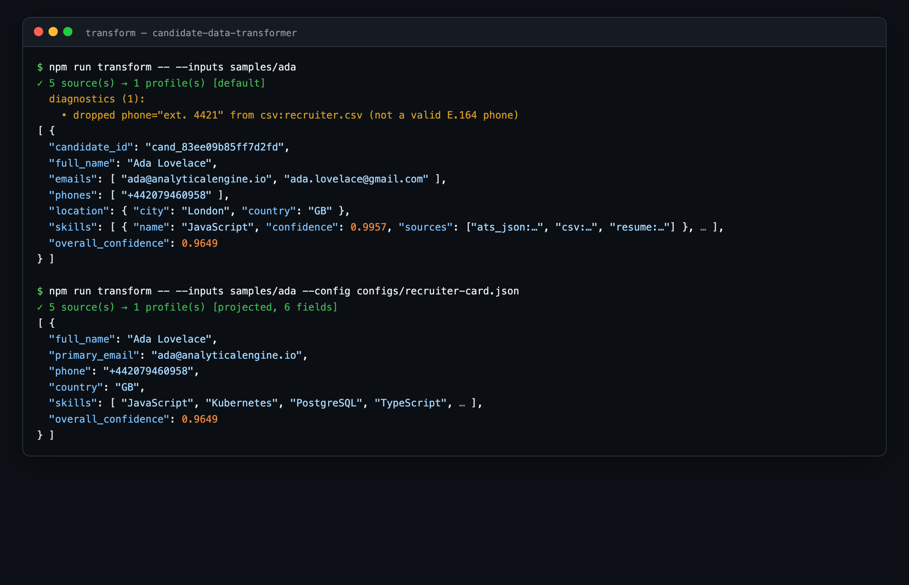
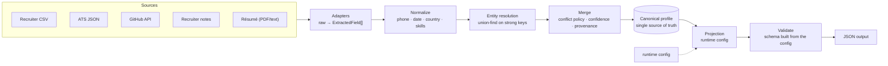
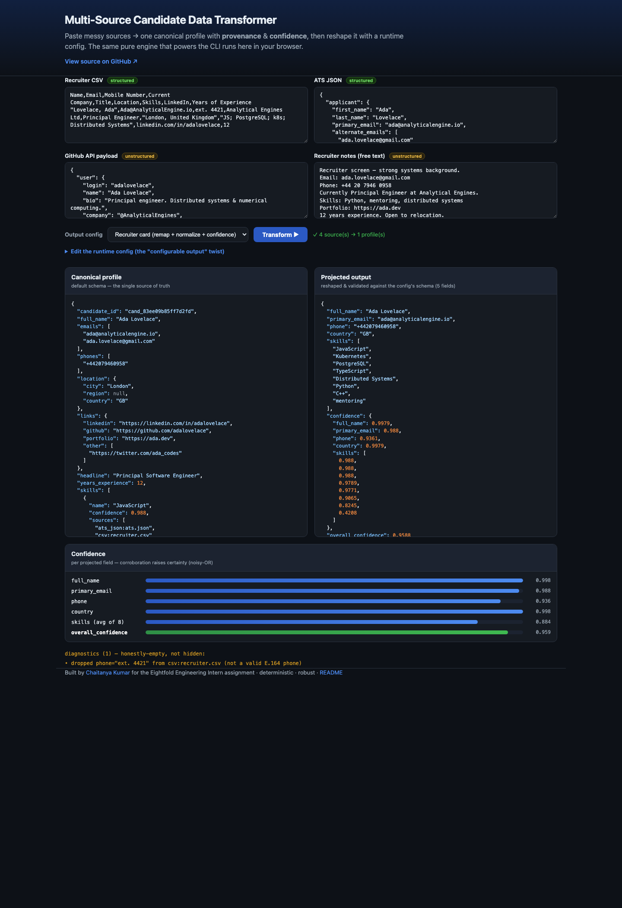

<div align="center">

# Multi-Source Candidate Data Transformer

**Messy candidate data from many sources → one clean, trustworthy profile — with provenance, calibrated confidence, and a config-driven output you can reshape without touching code.**

[](https://github.com/chaitanya21kumar/candidate-data-transformer/actions/workflows/ci.yml)


[](LICENSE)
[](https://candidate-data-transformer.netlify.app)

</div>

> Built for the Eightfold Engineering Intern assignment. Ingest a recruiter CSV, an ATS
> JSON export, a GitHub profile, recruiter notes and a résumé about the same person, and
> get back **one canonical profile** — every field traceable to where it came from and how
> sure we are of it, deduplicated across sources, in normalized formats.

<div align="center">
  
  <br/><sub>The CLI: five messy sources → one canonical profile (default), then reshaped through a runtime config.</sub>
</div>

---

## TL;DR

- **One trustworthy profile from many messy sources.** 5 source adapters → entity
  resolution → conflict resolution → a single canonical record.
- **Provenance + calibrated confidence on every value.** You can always answer *“where did
  this come from, and how sure are we?”*
- **Wrong-but-confident is worse than honestly-empty.** Unparseable phones, year-only
  dates and unknown countries become `null` (and are reported) — never guessed.
- **Configurable output, zero code changes.** A runtime config reshapes the result
  (subset, remap, normalize, toggles, missing-policy) and the result is **validated against
  a schema built from that config**.
- **Deterministic, robust, and fast.** Byte-identical runs, garbage never crashes it, and
  it sustains ~20k records/s.

> ▶ **Live demo:** https://candidate-data-transformer.netlify.app · **Demo video:** see [Demo](#demo)

---

## Table of contents

- [Architecture](#architecture)
- [Canonical schema & normalized formats](#canonical-schema--normalized-formats)
- [Merge & conflict resolution (worked example)](#merge--conflict-resolution-worked-example)
- [The configurable output (the killer feature)](#the-configurable-output-the-killer-feature)
- [Provenance & confidence](#provenance--confidence)
- [Demo](#demo)
- [Quickstart](#quickstart)
- [Sample inputs & outputs](#sample-inputs--outputs)
- [Edge cases handled](#edge-cases-handled)
- [Determinism · robustness · scale](#determinism--robustness--scale)
- [Tests & CI](#tests--ci)
- [Key design decisions](#key-design-decisions)
- [Assumptions & deliberate descopes](#assumptions--deliberate-descopes)
- [Project structure](#project-structure)
- [Tech stack & why](#tech-stack--why)
- [Author](#author)

---

## Architecture



**Flow:** each source is parsed by an **adapter** into atomic `ExtractedField` claims
(never throwing — malformed input yields nothing). Claims are **normalized** to canonical
formats, **resolved** into people via union-find on strong identifiers, then **merged** into
one canonical profile with a deterministic winner policy, corroboration-based confidence and
full provenance. A **projection** layer reshapes the canonical record per a runtime config,
and the result is **validated** against a Zod schema *built from that config*.

The engine under `src/core/` is **pure and isomorphic** — no Node-only dependencies — so the
exact same code runs in the CLI and in the browser demo. All file/PDF I/O is isolated in
`src/io/`.

---

## Canonical schema & normalized formats

The internal canonical profile *is* the default output schema:

| Field | Type | Normalized form |
|---|---|---|
| `candidate_id` | `string` | deterministic FNV-1a hash of the strongest identifier |
| `full_name` | `string \| null` | whitespace-tidied; `"Last, First"` reordered |
| `emails` | `string[]` | lowercased, de-duplicated, best-first |
| `phones` | `string[]` | **E.164** (`+919650762045`) |
| `location` | `{ city, region, country }` | `country` is **ISO-3166 alpha-2** |
| `links` | `{ linkedin, github, portfolio, other[] }` | canonical absolute URLs |
| `headline` | `string \| null` | |
| `years_experience` | `number \| null` | |
| `skills` | `[{ name, confidence, sources[] }]` | **canonical** skill names |
| `experience` | `[{ company, title, start, end, summary }]` | dates as **`YYYY-MM`** / `present` |
| `education` | `[{ institution, degree, field, end_year }]` | |
| `provenance` | `[{ field, source, method }]` | per value |
| `overall_confidence` | `number` | coverage-weighted, `[0,1]` |

Formats are enforced by the Zod schema with regexes, so a normalizer bug fails loudly
instead of shipping a bad value.

---

## Merge & conflict resolution (worked example)

**Same person across five sources, with a conflicting phone.** The recruiter CSV lists the
phone as `ext. 4421` (not a real number); the ATS, notes and résumé list a valid one.

| Source | Phone as written | After normalization |
|---|---|---|
| `csv:recruiter.csv` | `ext. 4421` | ❌ dropped — not a valid E.164 number |
| `ats_json:greenhouse.ats.json` | `0044 20 7946 0958` | ✅ `+442079460958` |
| `notes:notes.txt` | `+44 20 7946 0958` | ✅ `+442079460958` |
| `resume:resume.txt` | `+44 20 7946 0958` | ✅ `+442079460958` |

Result — the bad value is **dropped (honestly-empty), not guessed**, the valid one is kept,
and provenance records the three sources that agree:

```json
"phones": ["+442079460958"],
"provenance": [
  { "field": "phones[0]", "source": "ats_json:greenhouse.ats.json", "method": "structured_field" },
  { "field": "phones[0]", "source": "notes:notes.txt",              "method": "labeled_field" },
  { "field": "phones[0]", "source": "resume:resume.txt",            "method": "regex_extraction" }
]
```

The dropped value is reported as a diagnostic, not hidden:

```
diagnostics (1):
  • dropped phone="ext. 4421" from csv:recruiter.csv (not a valid E.164 phone)
```

**Match keys** (priority): `email > phone > github > name+company`. Strong keys are
authoritative and link transitively; `name+company` only attaches records that have no
strong identifier of their own, and only when unambiguous — so two different people who
share a name and employer are never merged. **Winner policy** for a single-valued conflict:
`(confidence, breadth of agreement, source trust, value)`, fully deterministic.

---

## The configurable output (the killer feature)

The canonical record and the **projection** are strictly separated. A runtime config can
select a subset of fields, **remap** them from any canonical path (`emails[0]`,
`skills[].name`, `experience[0].title`), apply **per-field normalization**, toggle
provenance/confidence, and choose what to do when a value is missing
(`null` | `omit` | `error`). The projection is then **validated against a Zod schema built
from the config itself**.

**Before — default schema** (`outputs/ada.default.json`, abridged):

```json
{
  "candidate_id": "cand_83ee09b85ff7d2fd",
  "full_name": "Ada Lovelace",
  "emails": ["ada@analyticalengine.io", "ada.lovelace@gmail.com"],
  "phones": ["+442079460958"],
  "location": { "city": "London", "region": null, "country": "GB" },
  "skills": [ { "name": "JavaScript", "confidence": 0.9957, "sources": ["ats_json:…", "csv:…", "resume:…"] }, "…" ],
  "overall_confidence": 0.9649
}
```

**Config** (`configs/recruiter-card.json`):

```json
{
  "fields": [
    { "path": "full_name", "type": "string", "required": true },
    { "path": "primary_email", "from": "emails[0]", "type": "string", "required": true },
    { "path": "phone", "from": "phones[0]", "type": "string", "normalize": "E164" },
    { "path": "country", "from": "location.country", "type": "string", "normalize": "country" },
    { "path": "skills", "from": "skills[].name", "type": "string[]", "normalize": "canonical" }
  ],
  "include_confidence": true,
  "on_missing": "null"
}
```

**After — projected output** (`outputs/ada.recruiter-card.json`, abridged):

```json
{
  "full_name": "Ada Lovelace",
  "primary_email": "ada@analyticalengine.io",
  "phone": "+442079460958",
  "country": "GB",
  "skills": ["JavaScript", "Kubernetes", "PostgreSQL", "TypeScript", "Distributed Systems", "…"],
  "confidence": { "full_name": 0.9988, "primary_email": 0.9943, "phone": 0.9696, "skills": [0.9957, "…"] },
  "overall_confidence": 0.9649
}
```

<details>
<summary><b>The three missing-value policies</b></summary>

For a field whose value is absent (e.g. a Twitter link this candidate doesn't have):

| `on_missing` | Behavior |
|---|---|
| `null` | key is present and set to `null` |
| `omit` | key is left out entirely |
| `error` | projection throws, naming the field |

A field marked `required` that ends up missing **fails schema validation** — the config's
contract is enforced, not merely hoped for.
</details>

See three configs in [`configs/`](configs/): `recruiter-card.json`, `ats-sync.json`
(provenance on, `on_missing: omit`, nested remap), and `contact-min.json`.

The same engine runs in the [**live demo**](https://candidate-data-transformer.netlify.app) —
paste sources, pick a config, and watch the canonical profile and the projected output
update side by side:

<div align="center">
  
</div>

---

## Provenance & confidence

Every value is traceable and scored:

- **Provenance** — `{ field, source, method }` for each contributing source.
- **Confidence** — a claim starts at `source trust × method trust`; independent agreeing
  sources combine via **noisy-OR** (`1 − Π(1 − cᵢ)`), so corroboration raises certainty.
- **`overall_confidence`** — coverage-weighted average over the identity-bearing fields.

```json
{ "name": "JavaScript", "confidence": 0.9957, "sources": ["ats_json:greenhouse.ats.json", "csv:recruiter.csv", "resume:resume.txt"] }
```

Three sources independently list JavaScript, so its confidence is high. A skill seen only in
free-text notes scores far lower — and you can see exactly why. Full model in
[DESIGN_NOTES.md](DESIGN_NOTES.md#6-confidence-model-all-in-srccoreconfidencets).

---

## Demo

- **▶ Live demo:** **[candidate-data-transformer.netlify.app](https://candidate-data-transformer.netlify.app)** —
  paste sources, pick a config, and watch the canonical profile and projected output update side by side.
- **📹 Walkthrough video (≈2 min):** <!-- VIDEO_LINK --> _coming with the submission_ — a screen recording running the
  pipeline end-to-end on the sample inputs, showing the default output and a custom-config output, and talking through
  one design decision (the canonical ⟂ projection split with config-driven validation) and one edge case (a phone
  conflict resolved by preferring `null` over a wrong value).

---

## Quickstart

```bash
git clone https://github.com/chaitanya21kumar/candidate-data-transformer.git
cd candidate-data-transformer
npm install

# Default schema — merge the 5 sources for one candidate
npm run transform -- --inputs samples/ada

# A custom config (remap + normalize + confidence)
npm run transform -- --inputs samples/ada --config configs/recruiter-card.json

# Run the tests, and regenerate the committed outputs
npm test
npm run build:outputs

# Scale benchmark (synthetic data)
npm run bench
```

The CLI prints clean JSON to stdout and a summary + diagnostics to stderr:

```
transform --inputs <files|dirs...> [--config <file>] [--out <file>]
          [--default-country <ISO2>] [--compact] [--quiet]
```

> Requires Node 18+. No API keys needed — the GitHub source uses a captured fixture so runs
> are deterministic and offline (the same adapter also reads a live `{user, repos}` payload).

---

## Sample inputs & outputs

No official sample inputs were provided with the assignment, so the fixtures under
[`samples/`](samples/) are constructed to exercise every source type and edge case.

| Sample | What it demonstrates | Output |
|---|---|---|
| [`samples/ada/`](samples/ada/) | one person across **5 sources** (CSV, ATS JSON, GitHub, notes, résumé) with a conflicting phone, duplicate emails, and cross-source corroboration → **1 profile** | [`outputs/ada.default.json`](outputs/ada.default.json) + 3 projections |
| [`samples/edge/`](samples/edge/) | **multi-candidate** batch: no-false-merge (two different "Jordan Lee"), cross-file merge (Grace via shared email), and **garbage/empty** sources that contribute nothing | [`outputs/edge.default.json`](outputs/edge.default.json) |

---

## Edge cases handled

| Case | Behavior |
|---|---|
| Phone not parseable to E.164 | dropped (honestly-empty) + diagnostic; never guessed |
| Bare local phone, no country code | `null` unless `--default-country` is given |
| Year-only date | `null` month — precision is never invented |
| Unknown / informal country (`UK`, `England`) | mapped to `GB`; unknown → `null` |
| Same person, conflicting values | deterministic winner by trust × confidence; agreement corroborates |
| Two different people, same name | **not merged** (name alone is never a key) |
| Same name + company, different emails | **not merged** (strong identifiers win) |
| Ambiguous note (name+company matches 2 people) | left unmerged rather than guessed |
| Duplicate emails / casing / whitespace | de-duplicated by normalized form |
| Malformed JSON / empty CSV / binary noise | source contributes `[]`; run continues |
| Skill aliases (`js`, `k8s`, `postgres`) | canonicalized; unknown skills kept, flagged |

---

## Determinism · robustness · scale

- **Deterministic** — no timestamps or randomness; stable ordering everywhere; identical
  inputs produce **byte-identical** output. CI regenerates `outputs/` and fails on any diff.
- **Robust** — every adapter is wrapped so a missing/garbage source can never crash the run;
  unknown values become `null`, never invented.
- **Scale** — near-linear union-find; the benchmark sustains **~20,000 records/s** and
  resolves **50,000 records in ~2.4s** on a laptop, asserting that 2N input records collapse
  to exactly N profiles.

```
$ npm run bench
candidates  records     time        throughput
1,000       2,000       107 ms      18,625 records/s
5,000       10,000      484 ms      20,667 records/s
10,000      20,000      1009 ms     19,824 records/s
25,000      50,000      2443 ms     20,464 records/s
```

---

## Tests & CI

83 tests across normalizers, adapters, the merge engine, projection and the full pipeline —
including a **gold-profile** test, a **determinism** test (two runs, deep-equal), an
**end-to-end PDF** extraction test against a real fixture, and a test asserting every
**committed output is schema-valid**.

```bash
npm test          # vitest
npm run typecheck # tsc --noEmit (strict)
```

CI (GitHub Actions) installs, type-checks, tests, then **regenerates the committed outputs
and fails on any diff** — a determinism gate baked into the pipeline.

---

## Key design decisions

- **Canonical record ⟂ projection.** The engine has one internal source of truth; the output
  shape is a separate, validated view. New output shapes need *zero* engine changes.
- **Honesty over coverage.** The pipeline would rather omit a value than assert a wrong one;
  drops are reported, not hidden.
- **Deterministic, explainable entity resolution.** Union-find on strong keys, with
  name+company as a careful weak fallback — no opaque ML, every merge defensible.
- **Validation derived from the request.** The output schema is *built from the config*, so
  "validate against the requested schema" is literal, not bespoke per shape.

More — including the bug the scale benchmark caught and how it reshaped entity resolution —
in **[DESIGN_NOTES.md](DESIGN_NOTES.md)**.

---

## Assumptions & deliberate descopes

- **LinkedIn is not scraped** (no public API, ToS) — LinkedIn URLs are captured as links;
  a `linkedin` source is treated as a user-provided export.
- **GitHub** uses a captured fixture for deterministic/offline runs; the same adapter reads
  a live payload.
- **No fuzzy/ML record linkage** — deterministic keys only (precision over recall).
- **Résumé parsing is best-effort, PDF-text only** (no OCR); DOCX export to PDF/txt.
- **Location parsing is heuristic** (no geocoding).

Full reasoning in [DESIGN_NOTES.md](DESIGN_NOTES.md#9-assumptions--deliberate-descopes-honest).

---

## Project structure

```
candidate-data-transformer/
├── src/
│   ├── core/                 # pure, isomorphic engine (no Node-only deps)
│   │   ├── adapters/         # csv · atsJson · github · notes · resume
│   │   ├── normalize/        # phone · date · country · skills · email · name · url
│   │   ├── merge/            # normalize → resolve (union-find) → build
│   │   ├── projection/       # path resolver + config-driven projection
│   │   ├── schema/           # canonical Zod schema + dynamic output schema
│   │   ├── confidence.ts     # the whole confidence model, in one file
│   │   └── pipeline.ts       # orchestration
│   ├── io/                   # Node file loading + PDF text extraction
│   └── cli.ts                # the `transform` command
├── configs/                  # default + custom output configs
├── samples/                  # constructed sample inputs (ada, edge)
├── outputs/                  # committed produced outputs
├── scripts/                  # build-outputs · benchmark · generate
├── tests/                    # vitest suites (83 tests)
└── .github/workflows/ci.yml
```

---

## Tech stack & why

| Choice | Why |
|---|---|
| **TypeScript (strict)** | the data shapes are the design; `noUncheckedIndexedAccess` catches edge bugs |
| **Zod** | one library for the canonical schema *and* the dynamically-built output schema |
| **libphonenumber-js** | correct, locale-aware E.164 normalization |
| **i18n-iso-countries** | full country-name → ISO alpha-2 coverage (+ a curated alias map) |
| **pdfjs-dist** | résumé PDF → text, lazily loaded so the core stays pure |
| **Vitest** | fast, ESM-native tests |
| _hand-rolled_ | the CSV parser, skill dictionary and path resolver — small, owned, defensible |

---

## Author

**Chaitanya Kumar** — IIIT Jabalpur, B.Tech CSE.
[GitHub](https://github.com/chaitanya21kumar) · built for the Eightfold Engineering Intern assignment.
